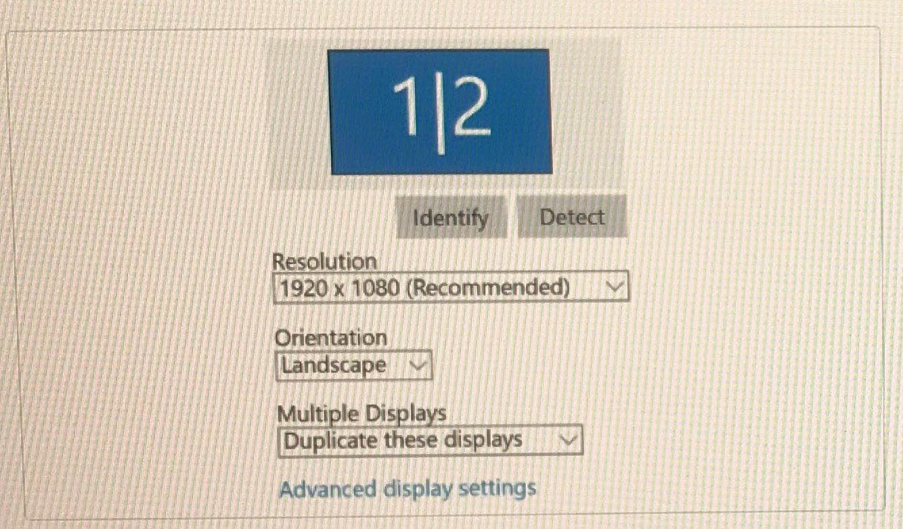
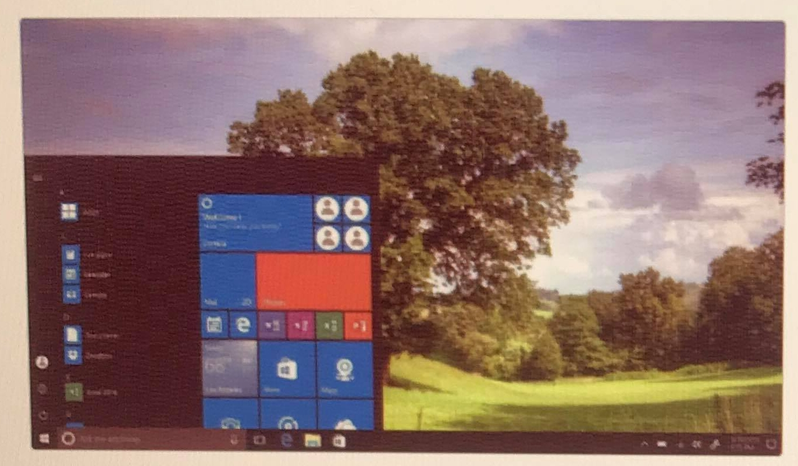

## Technical Support

#### Q1. Why is the PC showing the same display on two monitors?

- [ ] The resolution is too small for one monitor
- [ ] The resolution is too large for one monitor
- [x] The PC is extending the display on both monitors
- [ ] The PC is duplicating the display on both monitors
- [ ] The PC only has one monitor plugged in

#### Q2. Which part would you test?

- [ ] CPU
- [ ] PSU
- [ ] GPU
- [ ] RAM
- [ ] APU

#### Q3. Your manager asks you to get details on a computer crash. What Windows Administration Tool could you use?

- [ ] Windows Memory Diagnostic
- [ ] Log Viewer
- [ ] Event Viewer
- [ ] Performance Monitor
- [ ] System Information

#### Q4. A customer opened a file attachment, and now her PC is infected with randomware. She's unable to open any of her files. Which action would you take first?

- [ ] Reinstall the operating system
- [ ] Disconnect the PC from the network
- [ ] Pay the ransom to recover the data
- [ ] Run an antivirus scan
- [ ] Restore files from backup

#### Q5. In a Windows environment, what command would you use to find how many hops are required to reach google.com?

- [ ] Route google.com
- [ ] Netstat google.com
- [ ] Tracert google.com
- [ ] Ipconfig google.com
- [ ] Ping google.com

#### Q6. A customer wants to increase his storage capacity by 25 GB. Which would yield the highest performance?

- [ ] 25 GB PCI-E video card
- [ ] 25 GB SSD
- [ ] 25 GB HDD
- [ ] 25 GB DDR4 RAM
- [ ] 125 GB USB 3.0

#### Q7. Your manager asks you to set up a secure network connection at a remote site to move over some backups. Which protocol would you use?

- [ ] FTP
- [ ] SSH
- [ ] DHCP
- [ ] SFTP
- [ ] IP

#### Q8. The web development team is having difficulty connecting by SSH to your local web server, and you notice the proper rule is missing from the firewall.

- [ ] Port 21
- [ ] Port 22
- [ ] Port 25
- [ ] Port 80
- [ ] Port 443

#### Q9. A workstation is out of compliance with the group policy standards set by the domain. What command prompt would you use to ensure all policies are up to date?

- [ ] reset session < sessions number >
- [ ] policyupdate /force
- [ ] gpupdate /force
- [ ] gpresult /f
- [ ] gpconfig

#### Q10. A customer complains that his old tower PC doesn't always turn on and randomly shuts off for hours. The HDD and RAM memory tests both come back with positive results. What hardware part would you check next?

- [ ] SSD
- [ ] PSU
- [ ] EXT-USB HDD
- [ ] NIC
- [ ] PS/2

#### Q11. A user is unable to reach Google.com by typing the URL in the web browser but is able to reach it by typing in 172.217.3.110. What is the cause?

- [ ] The workstation oesn't have internet connectivity
- [ ] The DHCP server isn't functioning properly
- [ ] Google.com is being blocked by the company
- [ ] Google.com is down
- [ ] The workstation is unable to resolve the domain name to the IP addresses

#### Q12. What is the cause?

- [ ] Domain is improperly configured at the registrar
- [ ] Web server doesn't support HTTPS sites
- [ ] SSL certificate is invalid or self-signed
- [ ] User's browser doesn't support secure websites
- [ ] User needs to change the URL to http:// from https://

#### Q13. A Windows user is locked out of her computer, and you must log into the local administrator account HelpdeskAdmin. Which would you use in the username field?

- [ ] /HelpdeskAdmin
- [ ] .\HelpdeskAdmin
- [ ] .HelpdeskAdmin
- [ ] \\HelpdeskAdmin
- [ ] //HelpdeskAdmin

#### Q14. You're installing two new hard drives into your network attached storage device. Your director asks that they be put into a RAID solution that offers redundancy over performance. Which would you use?

- [ ] RAID 0
- [ ] RAID 1
- [ ] RAID 5
- [ ] RAID 6
- [ ] RAID 10

#### Q14. A customer is traveling to a branch office, and the network administrator provides her with a static IP address for her laptop. Which should the customer do to use the static IP address?

- [ ] Run the command "ipconfig configure static"
- [ ] Disconnect from WiFi and use an Ethernet cable
- [ ] Assign the static IP in network adapter settings
- [ ] Switch the button from dynamic to static on her laptop
- [ ] Type the IP address into the browser

#### Q15. Your internet is out, and devices connected by WiFi and ethernet will not connect. You check several websites, and all your packets fail. You then ping a website with an IP address, and to your surprise, it's a success.

- [ ] Open the Port Forwarding settings on your router and try turning on UPnP
- [ ] Open the Network settings on your router and try turning off your firewall
- [ ] Open the DHCP settings on your router and try using a different pool of private IP addresses
- [ ] Open the Network settings on your router and try adjusting the default gateway
- [ ] Open the DNS settings on your router and try using a different DNS
